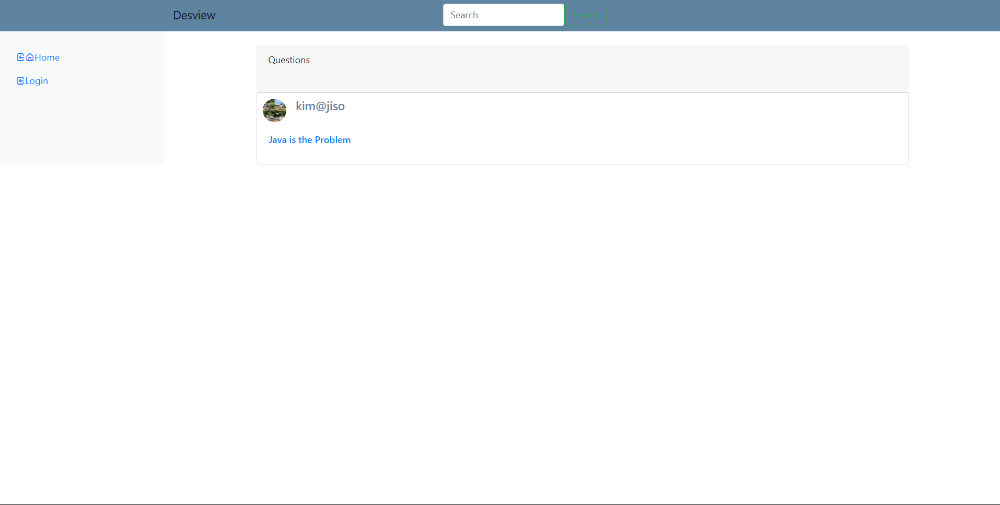
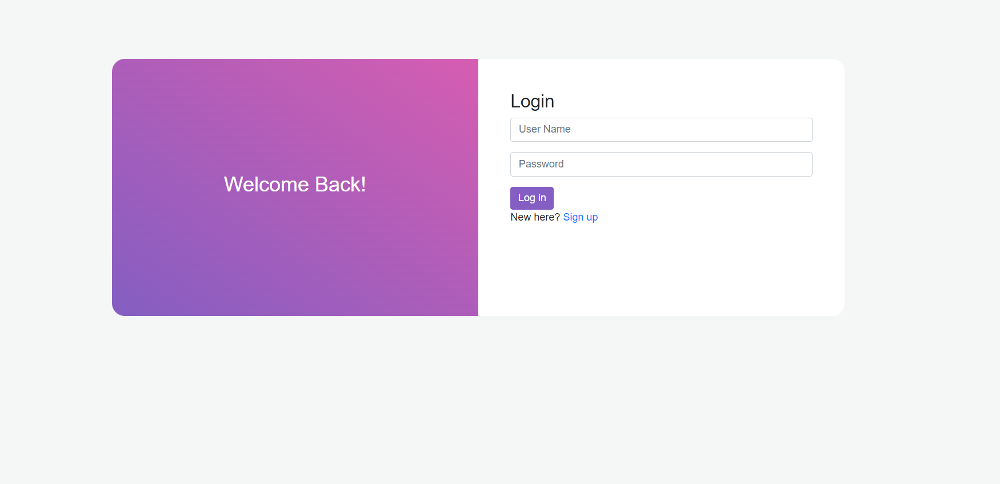
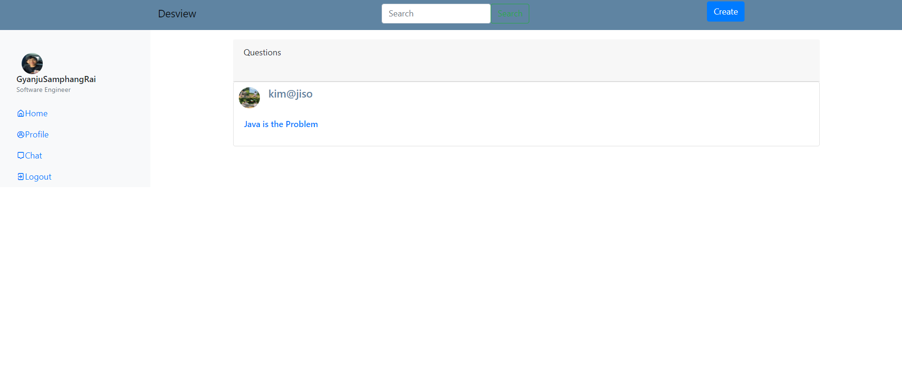
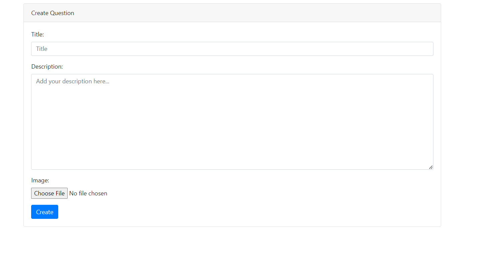

# Desview Application

This application allows users to ask questions.Users can register, log in, create question, update and delete questions, and users can interact with real-time chatting feature. The application follow the MVT (Model View Tempalte) pattern.

## Table of Contents

- [Project Overivew](#project-overview)
- [Prerequisites](#prerequisites)
- [Installation Instruction](#installation-instructions)
- [Screenshot](#screenshot)

## Project Overview

This application is my first ever project. User can perfrom CURD operation on Question. The UI is not good. 

## Prerequisites

Ensure you have following installed on your computer:

- Python (3.11)
- Django

## Installation Instructions

1. **Clone the repository**:
    ```bash
    git clone https://github.com/GyanjuRaoi/DesviewWebApp.git
    ```

2. **Run the application**:
    ```bash
    py manage.py runserver
    ```

## Screenshot

**Landing page**


**Login**


**Logged In page**


**Question Create page**



